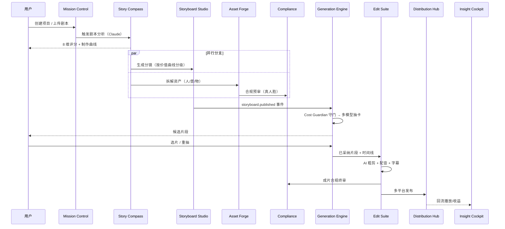
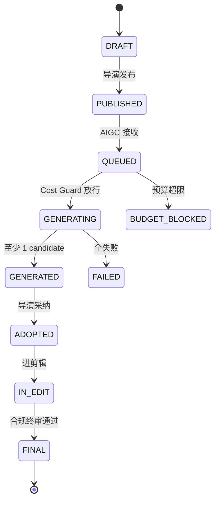

# 01 · 总体架构

> 设计哲学：**Modular Core / AI-First / Event-Driven / Human-in-the-Loop / Cost-Aware / Plugin-Native**

---

## 一、七层架构图

```
┌─────────────────────────────────────────────────────────────────────┐
│ ① EDGE LAYER     Web(PWA) · Desktop(Tauri) · iPad · Mobile · CLI    │
└─────────────────────────────────────────────────────────────────────┘
                                  ↕
┌─────────────────────────────────────────────────────────────────────┐
│ ② PRESENTATION LAYER                                                │
│   Next.js 15 App Router · React 19 · Tailwind v4 · shadcn/ui         │
│   ┌── Linear (分镜) ──┬── Canvas (脑暴) ──┬── Timeline (剪辑) ──┐   │
│   │  Director/AIGC   │  Wireless Canvas │  Edit Suite        │   │
│   └──────────────────┴──────────────────┴────────────────────┘   │
│   i18n: next-intl + ICU (CN/TW/EN/JP/KR/TH/ES)                       │
└─────────────────────────────────────────────────────────────────────┘
                                  ↕
┌─────────────────────────────────────────────────────────────────────┐
│ ③ REALTIME COLLAB LAYER (Phase 1: 分镜表 / Phase 2: 全面)           │
│   Y.js · Hocuspocus · Presence · 评论 · @ Mention · 版本树           │
└─────────────────────────────────────────────────────────────────────┘
                                  ↕
┌─────────────────────────────────────────────────────────────────────┐
│ ④ AI AGENT ORCHESTRATION LAYER (Phase 2 引入)                       │
│   LangGraph · CrewAI · Multi-Agent · Human Gates                     │
│   Director / Asset / Shot / Editor / Critic / Compliance Agent      │
│   + Cost Guardian (跨 Agent 预算护栏)                                │
└─────────────────────────────────────────────────────────────────────┘
                                  ↕
┌─────────────────────────────────────────────────────────────────────┐
│ ⑤ BACKEND SERVICES (Modular Monolith → 按负载拆 Microservices)       │
│   Project · Script · Storyboard · Asset · Generation · Compliance    │
│   Editing · Media · Vault · Analytics · Distribution · Audit · Auth  │
│   API: tRPC (前端) + GraphQL Federation (跨模块) + REST (第三方)     │
└─────────────────────────────────────────────────────────────────────┘
                                  ↕
┌─────────────────────────────────────────────────────────────────────┐
│ ⑥ MEDIA PIPELINE & AI PROVIDER LAYER                                 │
│   BullMQ + Temporal · GPU Workers · FFmpeg · Remotion                │
│   LiteLLM Adapter ←→ {Seedance, Veo, Nano Banana, GPT-Image, 豆包,   │
│                       Claude, Kling, MiniMax, Suno, ElevenLabs, ...} │
│   Cost Ledger middleware · Rate-limit · Provider Failover            │
└─────────────────────────────────────────────────────────────────────┘
                                  ↕
┌─────────────────────────────────────────────────────────────────────┐
│ ⑦ DATA & STORAGE LAYER                                               │
│   PostgreSQL 16 + Prisma + pgvector  ·  ClickHouse (Phase 2)         │
│   Redis 7 (BullMQ + Cache)  ·  S3-Compatible (MinIO/R2/OSS)          │
│   Meilisearch (全文)  ·  NATS JetStream (Phase 2 多实例事件总线)     │
└─────────────────────────────────────────────────────────────────────┘
            OBSERVABILITY  OpenTelemetry · Sentry · LangSmith
```

---

## 二、Monorepo 结构

```
starsalign-studio/                  # 总文件 ~200，部分已完成
├── apps/
│   ├── web/                       # Next.js 15 App Router (已完成)
│   └── desktop/                   # Tauri 包装 (W7 主题，目前空目录)
│
├── packages/
│   ├── shared/                    # 共享类型/常量/Zod/Events (✅ 16 文件)
│   ├── db/                        # Prisma Client + 24 表 (✅ 7 文件)
│   ├── i18n/                      # next-intl + CN/EN 词条 (✅ 13 文件)
│   ├── adapters/                  # ★ 云端切换命脉 (✅ 34 文件)
│   │   ├── storage/               # MinIO / LocalFs / R2 / OSS
│   │   ├── provider/              # Seedance / Claude / 豆包 / ...
│   │   ├── eventbus/              # InProcess / NATS (Phase 2)
│   │   └── auth/                  # Local JWT / Clerk (Phase 2)
│   ├── core/                      # 领域逻辑 pure functions (✅ 14 文件)
│   ├── api/                       # tRPC v11 + 6 routers (✅ 13 文件)
│   ├── workers/                   # BullMQ workers (W5+，目前空)
│   └── ui/                        # 跨 web/desktop 共享 UI (Phase 2)
│
├── infra/
│   ├── docker-compose.yml         # PG + Redis + MinIO
│   └── postgres/init/             # 启动 SQL
│
└── docs/                          # 规划文档（本目录）
```

依赖方向（**严格单向**，无循环）：
```
shared → db → i18n → adapters → core → api → web
                       ↘  workers  ↗
```

---

## 三、三大 Adapter 抽象（云端切换命脉）

### 3.1 StorageAdapter
**接口**：`packages/adapters/storage/types.ts`

```typescript
export interface StorageAdapter {
  putObject(key, data, opts): Promise<PutResult>;
  getObject(key): Promise<Readable>;
  getSignedUrl(key, expiresIn?): Promise<string>;
  deleteObject(key): Promise<void>;
  // ...
}
```

| 环境 | 实现 |
|---|---|
| Phase 1 本地 | `MinioStorageAdapter` / `LocalFsStorageAdapter` |
| Phase 2 云端 | 同 MinIO adapter（S3 兼容，仅换 ENV）|
| 切换方式 | `STORAGE_DRIVER=minio\|local-fs\|r2\|oss\|s3` |

### 3.2 ProviderAdapter
**接口**：`packages/adapters/provider/types.ts`

```typescript
export interface IVideoProvider {
  generate(req, ctx): Promise<VideoResult>;
  estimateCost(req): number;
  maxDuration: number;
}
export interface ITextProvider { ... }
export interface IImageProvider { ... }
export interface IComplianceProvider { ... }
```

**注册中心**：`packages/adapters/provider/index.ts`
- DB-First 加载（从 ProviderConfig 表读 + 解密 API Key）
- 缓存策略：`providerId + updatedAt 时间戳` 作为 cache key
- 更新 API Key 后自动失效

| Provider | 状态 |
|---|---|
| Seedance 2.0 / Fast（视频）| ✅ 已实现 |
| Claude Sonnet 4.5（文本）| ✅ 已实现 |
| 豆包 1.5 Pro（文本）| 🔧 占位待实现 |
| Nano Banana Pro（图片）| 📋 待实现 |
| GPT Image 2（图片）| 📋 待实现 |
| 火山合规（Compliance）| 📋 待实现 |
| LiteLLM（统一代理）| 📋 Phase 2 |

### 3.3 EventBus + Auth
**接口**：`packages/adapters/eventbus/types.ts` · `auth/types.ts`

| Phase 1 | Phase 2 |
|---|---|
| InProcessEventBus（Node EventEmitter） | NatsEventBus（NATS JetStream） |
| LocalAuthAdapter（JWT + bcrypt） | Clerk / WorkOS |

切换方式：`EVENT_BUS_DRIVER=in-process\|nats` · `AUTH_DRIVER=local\|clerk\|workos`

---

## 四、升级性基础设施（Phase 2/3 接入点）

### 4.1 EventBus Topics — 集中类型化定义
**文件**：`packages/shared/src/events.ts`（46 个 topic + 类型化 Payload）

按领域分组：
- 项目 / 集（4 个）
- 剧本 / 分析（4 个）
- 分镜（4 个）
- 数字资产（6 个）
- AIGC 抽卡（7 个）
- 媒体库（3 个）
- 剪辑 / 成片（2 个 · Phase 2）
- 合规（3 个）
- 配音 / 音频（2 个 · Phase 2）
- 发行（2 个 · Phase 3）
- 成本 / 预算（5 个）
- 团队 / 通知（4 个）
- 系统（3 个）

**使用方式**：
```typescript
import { EVENTS, EventOf } from '@ss/shared/events';
bus.publish<EventOf<typeof EVENTS.GENERATION_COMPLETED>>(
  EVENTS.GENERATION_COMPLETED,
  { attemptId, shotId, mediaItemId, durationS, costCny }
);
```

### 4.2 共用 Zod Schemas
**目录**：`packages/shared/src/schemas/`

| 文件 | 覆盖范围 |
|---|---|
| `project.ts` | 项目 CRUD |
| `episode.ts` | 集数 / 剧本上传 / 分析 |
| `shot.ts` | 分镜 / 合并 |
| `asset.ts` | 资产 / 拆解 |
| `generation.ts` | 视频 / 图片生成 |
| `compliance.ts` | 合规请求 / 结果 |
| `voice.ts` | 配音克隆 / 生成 |
| `team.ts` | 邀请 / 集数分配 |

### 4.3 Cost Ledger 中间件
**位置**：`packages/adapters/provider/base.ts` + `packages/core/cost/ledger.ts`

每次 Provider 调用自动记录：
- 成本（CNY）
- 时长 / token 数
- 项目 / 集 / 镜头归属
- 成功 / 失败状态
- billingCycle（月度归集，付费 Phase 2 用）

升级路径：
- Phase 1：项目级总预算护栏
- Phase 2：What-If 模拟 + 月度账单
- Phase 3：ROI 反向喂回 Agent 决策

### 4.4 数据库预留字段
Schema 中已埋好 Phase 2/3 钩子（详见 `docs/04-data-model.md`）：
- Canvas：`Shot.positionX/Y`
- 3D：`Asset.model3dUrl / gaussianUrl`
- LoRA：`Asset.loraIds[]`
- Voice：`Asset.voiceMediaId`
- 合规：`Asset.complianceId / complianceStatus`
- 多语言：`User.locale`

---

## 五、关键流程数据流

### 端到端业务流程


### 镜头核心状态机


详细的模块设计与状态机见 `docs/02-modules-design.md`。

---

## 六、技术栈速览

| 层 | Phase 1 选型 | Phase 2 升级路径 |
|---|---|---|
| 桌面 | Tauri 2（W7 后） | — |
| 前端 | Next.js 15 + Tailwind v4 + shadcn | — |
| API | tRPC v11 + Zod | + GraphQL Federation |
| DB | PostgreSQL 16 + Prisma | + pgvector + read replica |
| 缓存 | Redis 7 | — |
| 队列 | BullMQ | + Temporal（长流程） |
| 存储 | MinIO（本地） | R2 / OSS / S3 |
| 协作 | Y.js + Hocuspocus | — |
| Agent | 无（同步调用） | LangGraph + CrewAI |
| Provider | Seedance + Claude（已接） | + LiteLLM 多模型 |
| Auth | 本地 JWT | Clerk / WorkOS |
| i18n | next-intl + CN/EN | + JP/KR/TH/ES |
| 监控 | Pino + OTEL stub | Grafana + LangSmith |

具体决策见 `docs/05-tech-decisions.md`。
