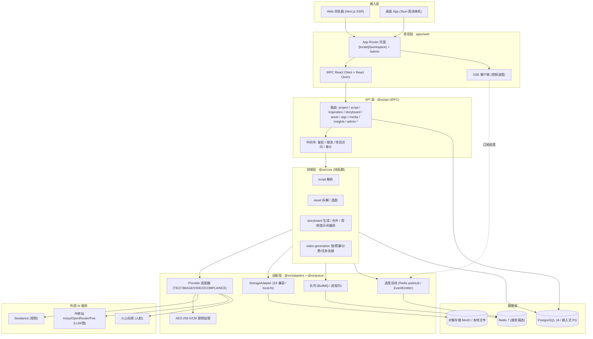
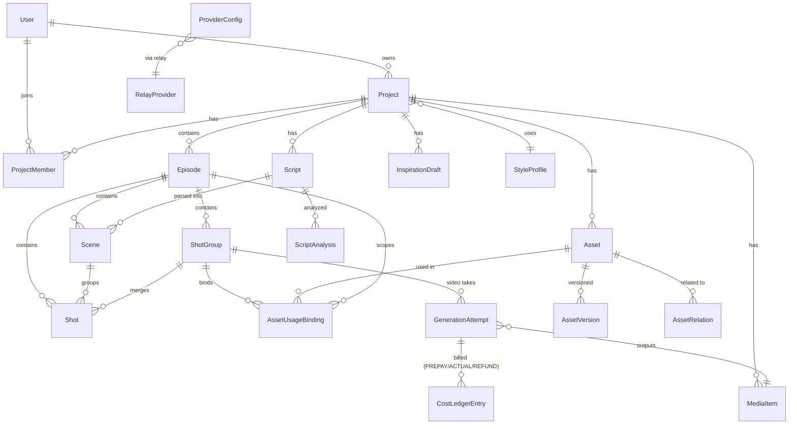
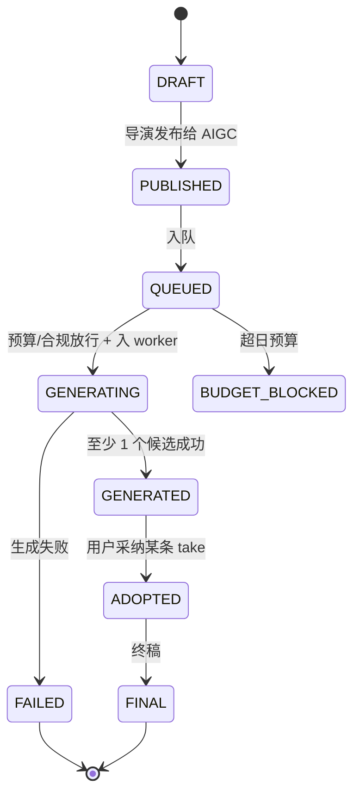
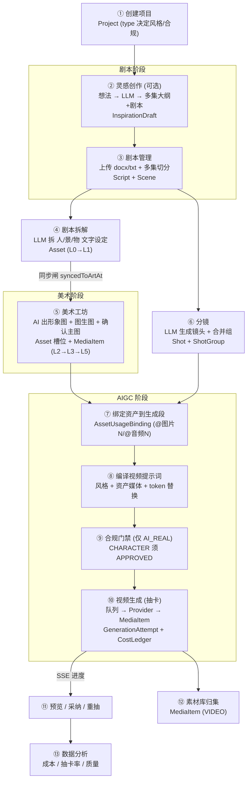
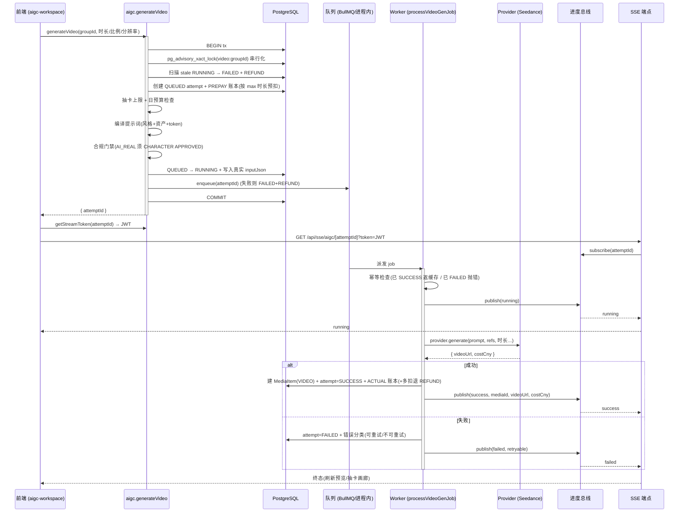
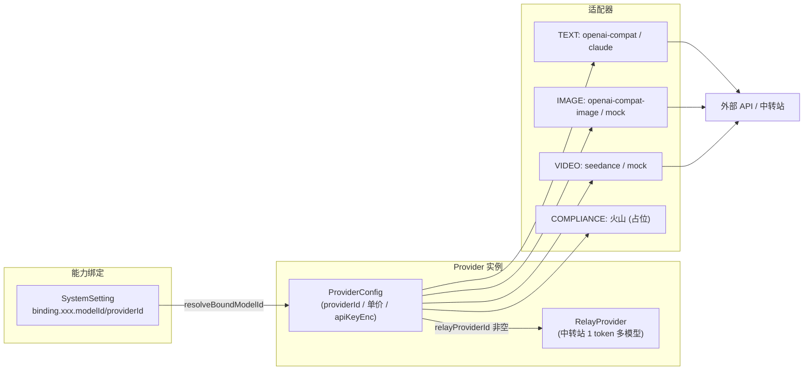
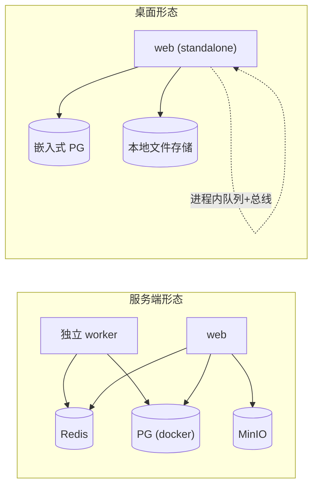

# StarsAlign Studio · 完整开发文档

> 星垣工坊 · AI 短剧/影视协作生产平台
> ⚠️ **快照式文档 · 可能滞后**:本文对应代码快照 `d80d100`(2026-06-09),反映 Phase 1 + Phase 1.5;此后 v0.2.0 导演链路重构(拆解换源=分镜脚本快照 / 美术侧拆解下线 / 流水线 stepper)等变更未回写,**现行实现以 docs/01–05 + 代码为准**。
> 与 `docs/01-architecture.md`(设计哲学 / Phase 2-3 蓝图)互补:**本文写"现在是什么样"**,01 写"愿景与方向"。
> 📊 **图片版流程图**:下文 7 张 Mermaid 图已渲染为 PNG(3x 高清)+ SVG(矢量),集中见图册 [`docs/diagrams/README.md`](diagrams/README.md)。

---

## 目录

1. [项目概述](#1-项目概述)
2. [技术栈](#2-技术栈)
3. [系统架构](#3-系统架构)
4. [领域模型与数据库](#4-领域模型与数据库)
5. [功能模块详解](#5-功能模块详解)
6. [端到端业务流程](#6-端到端业务流程)
7. [视频生成深度剖析](#7-视频生成深度剖析)
8. [AI Provider 与绑定系统](#8-ai-provider-与绑定系统)
9. [基础设施与可插拔驱动](#9-基础设施与可插拔驱动)
10. [桌面端打包(Tauri)](#10-桌面端打包tauri)
11. [认证与桌面激活](#11-认证与桌面激活)
12. [本地开发与协作流程](#12-本地开发与协作流程)
13. [目录结构速查](#13-目录结构速查)
14. [Phase 2/3 预留接入点](#14-phase-23-预留接入点)

---

## 1. 项目概述

**StarsAlign Studio(星垣工坊)** 是一个面向 AI 短剧 / 影视内容的**协作式生产平台**,把"从想法到成片"的工业流程拆成可串联的模块:

```
灵感 → 剧本 → 剧本拆解(人/景/物设定) → 美术工坊(出形象图) → 分镜 → AIGC 视频生成 → 素材库
```

核心设计理念(详见 `docs/01-architecture.md`):

- **Modular Core**:领域逻辑(`@ss/core`)是纯函数,与 I/O、框架解耦。
- **AI-First**:剧本分析、拆解、分镜、图/视频生成全部由可绑定的 AI Provider 驱动。
- **Human-in-the-Loop**:每个 AI 输出都可人工编辑;编辑动作落 `PromptEdit` 表(未来训练数据)。
- **Cost-Aware**:每次 Provider 调用都进 `CostLedger`,带预算护栏、预扣/退款。
- **Cloud-or-Local(双形态)**:同一套代码,通过**可插拔驱动**既能跑服务端(Docker:PG+Redis+MinIO),又能打包成**离线桌面 app**(内嵌 Postgres,零外部依赖)。

**项目类型(`ProjectType`)**:`AI_REAL`(AI 真人短剧)· `ANIM_3D`(3D 国漫)· `ANIM_2D`(2D 动漫)· `POSTER`(海报/宣传)· `CUSTOM`。
项目类型决定**风格(StyleProfile)**与**合规策略**(仅 `AI_REAL` 需人脸合规)。

---

## 2. 技术栈

| 层 | 选型 | 版本 |
|---|---|---|
| 包管理 / Monorepo | pnpm workspace + Turbo | pnpm 9.12.0 · turbo 2.1.x |
| 运行时 | Node.js | ≥ 20.18.0 |
| 语言 | TypeScript | 5.6.x |
| 前端框架 | Next.js(App Router) + React | Next.js 15(实测构建 15.5.x)· React 19 RC |
| 样式 / UI | Tailwind CSS 4(alpha) + Radix(shadcn 风格) | tailwindcss 4.0.0-alpha |
| API | tRPC + Zod + superjson | tRPC 11 RC · zod 3.23 |
| 数据请求 | TanStack Query(React Query) | 5.59 |
| 轻状态 | Zustand | 5.0 |
| i18n | next-intl(zh-CN / en) | 3.21 |
| ORM / DB | Prisma + PostgreSQL | Prisma 7.8.0 · PG 16 |
| 队列 / 缓存 | BullMQ + ioredis + Redis | bullmq 5.21 · Redis 7 |
| 对象存储 | S3 兼容(`@aws-sdk/client-s3`)→ MinIO / R2 / OSS / S3;或 local-fs | aws-sdk-s3 3.668 |
| 认证 | 本地 JWT(jose)+ bcryptjs | HS256 · bcrypt cost 10 |
| 桌面壳 | Tauri 2 + embedded-postgres | @tauri-apps/cli 2.1 · PG16 嵌入式 |
| 实时进度 | SSE(Server-Sent Events)+ Redis pub/sub / 进程内 EventEmitter | — |

依赖方向(**严格单向,无环**):

```
shared → db → i18n → adapters → core → api → web
                          ↘ queue / workers ↗
```

---

## 3. 系统架构

### 3.1 分层架构(已实现部分)



### 3.2 Monorepo 结构

| 包 / App | 路径 | 职责 |
|---|---|---|
| `@ss/web` | `apps/web` | Next.js 15 全栈应用(页面 + API Routes + tRPC handler + SSE) |
| `@ss/desktop` | `apps/desktop` | Tauri 2 桌面壳(`src-tauri/` Rust + sidecar) |
| `video-gen worker` | `apps/workers/video-gen` | BullMQ 视频生成消费者(服务端态独立进程) |
| `@ss/shared` | `packages/shared` | 共享类型 / 常量 / Zod schema / EventBus topic 定义 |
| `@ss/db` | `packages/db` | Prisma schema + migrations + seed / seed-sync |
| `@ss/i18n` | `packages/i18n` | next-intl 配置 + zh-CN/en 词条 |
| `@ss/adapters` | `packages/adapters` | Provider / Storage / Auth / EventBus 适配器 + 加密 |
| `@ss/core` | `packages/core` | 领域纯逻辑(script/asset/storyboard/video-generation) |
| `@ss/api` | `packages/api` | tRPC root router + context + 中间件 |
| `@ss/queue` | `packages/queue` | 队列 / 缓存 / 进度总线(可插拔驱动) |

---

## 4. 领域模型与数据库

> 完整 schema 见 `packages/db/prisma/schema.prisma`(单一真相源)。下面是核心实体与关系。

### 4.1 业务实体层级

```
Project(项目)
 └─ Episode(集)
     ├─ Scene(场, 如 1-1)
     │   └─ Shot(单镜)
     └─ ShotGroup(分镜合并组, 如 "1-8" —— 一次性送给视频模型的生成单元)
         ├─ Shot[](组内单镜)
         ├─ AssetUsageBinding[](本组绑定的资产 + @图片N/@音频N 槽位)
         └─ GenerationAttempt[](视频抽卡记录)

Asset(数字资产: 人物/场景/道具/风格参考)
 ├─ 命名槽位(portrait / threeView / sceneMain/Front/Left/Right/Back / panorama / mainMedia)
 ├─ AssetVersion[](版本化)
 └─ AssetUsageBinding[](在哪些 episode/scene/shotGroup/shot 出场)

MediaItem(媒体中台: 图/视频/音频, 项目级或公共库)
GenerationAttempt(所有 AI 生成尝试, 抽卡) → CostLedgerEntry(成本账本)
```

### 4.2 核心 ER 图



### 4.3 关键枚举与状态

| 枚举 | 取值 | 用途 |
|---|---|---|
| `ProjectType` | AI_REAL / ANIM_3D / ANIM_2D / POSTER / CUSTOM | 项目类型 → 风格 + 合规策略 |
| `EpisodeStatus` | NOT_STARTED / IN_PROGRESS / GENERATING / COMPLETED / ARCHIVED | 集状态(GENERATING=分镜生成软锁) |
| `ShotStatus` | DRAFT / PUBLISHED / QUEUED / GENERATING / GENERATED / ADOPTED / FINAL / FAILED / BUDGET_BLOCKED | 镜头/组状态 |
| `AttemptStatus` | QUEUED / RUNNING / SUCCESS / FAILED / TIMEOUT / CANCELLED / BUDGET_BLOCKED | 生成尝试状态机 |
| `AssetMaturity` | L0_IDENTIFIED → L5_PRODUCTION_READY | 资产成熟度(从槽位 + 状态派生) |
| `ComplianceStatus` | NOT_REQUIRED / PENDING / APPROVED / REJECTED / EXPIRED | 人脸合规(仅 AI_REAL 卡 APPROVED) |
| `LedgerEntryType` | NORMAL / PREPAY / REFUND / ADJUSTMENT | 成本账本条目类型(视频预扣/退款) |
| `ProviderKind` | VIDEO / IMAGE / TEXT / AUDIO / COMPLIANCE / EMBEDDING | Provider 能力分类 |

### 4.4 镜头/资产状态机



> **软删除**:几乎所有表用 `deletedAt` 软删 + partial unique index(`WHERE deletedAt IS NULL`)。
> Prisma 7 的 `@@unique` 不支持 partial,故 schema 里**故意不写 `@@unique`**,改由 migration 手写(见 schema 注释)。改 schema 时务必保留这一约定,否则 `migrate dev` 会破坏软删防御。

---

## 5. 功能模块详解

> 前端在 `apps/web/app/[locale]/(workspace)/projects/[id]/<module>`,后端对应 `@ss/api` 的 router。

### 5.1 项目管理(Projects)
- **页面**:`/projects`(列表+搜索)、`/projects/[id]`(总览)。
- **组件**:`projects-list.tsx`、`create-project-dialog.tsx`(创建/编辑复用)、`project-overview.tsx`。
- **后端**:`project` router(create/list/update/delete + 成员管理 + 集分配 W6 协作)。

### 5.2 导演工作台(Director / Storyboard)
统一入口 `/director/storyboard?ep=<episodeId>&tab=<tab>`,**URL 驱动状态**(可分享、SSR 注入避免闪烁)。四个 tab:

| Tab | 子模块 | 说明 |
|---|---|---|
| `script` | **剧本管理** | 上传 docx/txt/md/rtf/html;**多集自动切分**(识别 `第N集`/`Episode N`)。docx 用 mammoth 解析。 |
| `breakdown` | **剧本拆解** | LLM 从完整剧本拆出人/景/物的**文字设定**(性别/年龄/MBTI/小传/出场集);三栏:资产列表 / 编辑 / 关系绑定。有"同步闸"`syncedToArtAt` 推送到美术工坊。 |
| `shots` | **分镜** | 镜头列表 + 细节(景别/角度/运镜/光线 + 提示词);LLM 生成 + 可逆合并组。 |
| `inspiration` | **灵感创作** | 想法 → LLM 生成多集大纲 + 各集剧本(`InspirationDraft`);顶置(pinned)的草稿可在剧本管理"关联剧本"转正为某集正式剧本。 |

- **后端**:`script`(upload/analyze)、`inspiration`、`storyboard`(listEpisodes/generateForEpisode/mergeShotGroup/publishEpisode/recordEdit)。
- **核心逻辑**:`@ss/core/script`(parse)、`@ss/core/storyboard`(generate/merge/video 提示词编译)。
- **工具**:`@ss/api/utils/script-extract.ts`(文件→纯文本,docx 永远走 mammoth,binding 值异常时优雅回退,**绝不阻断上传** —— 见六五修复)。

### 5.3 美术工坊(Art Workshop)
- **页面**:`/art?type=CHARACTER|SCENE|PROP|STYLE_REFERENCE`。
- **能力**:资产卡片网格、信息编辑、**AI 图像生成 + 图生图(img2img)**、候选图画廊、确认主图(写回 `Asset.<slot>MediaId`)、缺图检测 + 批量生成、出场绑定查看(用在哪些镜头)。
- **关键组件**:`art-workspace.tsx`、`asset-edit-dialog.tsx`(+ info/generation/candidate/usage 子面板)、`art-batch-generate.tsx`、`gap-detection-dialog.tsx`。
- **后端**:`asset` router(create/update/generateImage/listBindings/...);`@ss/core/asset`(breakdown 拆解 / compile-prompt 拼提示词 / media-select 选图回退链)。

### 5.4 AIGC 视频生成
- **页面**:`/aigc`(按状态筛选集:NOT_STARTED/IN_PROGRESS/COMPLETED)→ `/aigc/[episodeId]`(生成工作台)。
- **工作台**:对每个 **ShotGroup** 可:自动匹配资产、自动打标(注入 `@图片N`/`@音频N` token)、手动绑定、编辑提示词、**生成视频**、查看抽卡历史 + 视频预览。
- **实时进度**:`useAigcProgress(attemptId)` → 取 SSE token → 连 `/api/sse/aigc/[attemptId]` → 监听 `running/progress/success/failed`,token 过期自动重连。
- **关键文件**:`aigc-workspace.tsx`、`video-preview-section.tsx`、`lib/hooks/use-aigc-mutations.ts`、`lib/hooks/use-aigc-progress.ts`。
- **后端**:`aigc.*`(generateVideo / getStreamToken / listVideoTakes / rejectVideoTake / 绑定 / prompt 编辑 / group 管理)。详见 [§7](#7-视频生成深度剖析)。

### 5.5 素材库(Library)
- **页面**:`/library`(全局,跨项目)。
- **能力**:按媒体类型(IMAGE/VIDEO/AUDIO)+ 资产类别(CHARACTER/SCENE/PROP/OTHER)+ 文本筛选;上传 / 删除 / 收藏 / 分页(48/页)/ 视频内联预览。
- **后端**:`media` router;数据落 `MediaItem`(scope=PUBLIC/PROJECT/PERSONAL)。

### 5.6 数据分析(Insights)
- **页面**:`/insights?days=7|30|90`。成本趋势、模型用量分布、Top 项目/镜头质量。
- **后端**:`insights` router(聚合 `CostLedgerEntry` / `GenerationAttempt`)。

### 5.7 管理后台(Admin,需 `isAdmin`)
左侧栏导航,主要子页:

| 页面 | 功能 |
|---|---|
| `/admin`(Dashboard) | 总成本/图/视频成本 KPI |
| `/admin/providers` | **AI Provider 凭证**(API Key 加密存储)、直连/中转模式、模型 catalog |
| `/admin/bindings` | **能力→模型绑定**(剧本分析/拆解/分镜/灵感/图/视频各绑哪个 Provider) |
| `/admin/prompts` | Prompt 模板库 |
| `/admin/styles` | StyleProfile(风格:角色/场景/道具提示词 + 禁词) |
| `/admin/presets` | 景别/机位/运镜/光线预设 |
| `/admin/users` | 用户管理 |
| `/admin/audit` | OperationLog 审计 |
| `/admin/settings` | 系统 KV 设置(预算/抽卡上限/合规开关等) |
| `/admin/api-usage` · `/admin/health` · `/admin/db-explorer` | 用量 / 健康 / DB 检查 |

- **后端**:`admin.*` 拆成 15 个子 router(provider/relay/binding/system/style/prompt/preset/episode/dashboard/health/audit/apiUsage/user/reports/dbExplorer)。

---

## 6. 端到端业务流程

下面是"从想法到成片"的主干流程(节点标注落库实体):



**关键串联点**:
- **剧本拆解 → 美术**:不复制数据,只翻转 `Asset.syncedToArtAt` 闸;最终以美术工坊微调为准。
- **资产 → 分镜组**:`AssetUsageBinding.refSlotIdx` 给每个绑定分配稳定槽位号(只增不复用,保证历史抽卡的 `@图片N` 引用不错位)。
- **提示词编译**:`@图片N`/`@音频N` token → 实际媒体 URL,带回退链(portrait → threeView → mainMedia)。

---

## 7. 视频生成深度剖析

视频生成是系统最复杂的链路,涉及**事务锁 + 预扣计费 + 合规门禁 + 队列 + SSE 进度 + 退款**。

### 7.1 时序图



### 7.2 关键机制

**① 事务级 advisory 锁**(`@ss/core/video-generation/lock.ts`)
`SELECT pg_advisory_xact_lock(hashtext('video:'||groupId))` —— 串行化同一组的并发生成请求,锁随事务结束自动释放。防止并发双生成 / 生成与改 prompt 竞态。

**② 预扣 → 退款计费**(`prepay.ts` / `refund.ts` / `budget-check.ts`)

| 阶段 | 账本写入 |
|---|---|
| 创建 QUEUED | `PREPAY`(按 max 时长 × 单价估算) |
| 成功(实际 < 预扣) | `ACTUAL` + `REFUND`(退差额) |
| 失败 / 预算超限 / stale 回收 | `REFUND`(全额退,幂等:已退则跳过) |

> Mock provider(成本 0)跳过账本噪音;退款幂等检查防重复退。

**③ 合规门禁**(`compile.ts` 返回 `projectType` + 角色合规状态)
仅当 `projectType === 'AI_REAL'` 且系统开关开启时,要求所有出场 CHARACTER 资产 `complianceStatus = APPROVED`,否则拒绝。动漫/海报等类型直接跳过(默认 NOT_REQUIRED)—— 这是六四修复的根因。

**④ 队列与进度的双驱动**(详见 [§9](#9-基础设施与可插拔驱动))
- 服务端:`QUEUE_DRIVER=bullmq` + `PROGRESS_BUS_DRIVER=redis`(独立 worker 进程,Redis pub/sub)。
- 桌面:`QUEUE_DRIVER=in-process` + `PROGRESS_BUS_DRIVER=in-process`(同进程 EventEmitter)。
- ⚠️ **globalThis 单例陷阱**(六四修复):Next standalone 把注册方与入队方编进不同模块实例,故进程内 handler 与 `progress-bus._instance` 都存 **globalThis**,否则打包态注册在 A、读取在 B(null)。

**⑤ 幂等与 stale 回收**(`process-job.ts` / `recover.ts`)
worker 入口先查 attempt 终态(已 SUCCESS 返缓存、已 FAILED 抛错),防 worker 重启重复建 MediaItem/账本;RUNNING 超时(组级 10min / worker 启动 30min)自动 → FAILED + REFUND。

---

## 8. AI Provider 与绑定系统

### 8.1 三层抽象



### 8.2 Provider 适配器(`packages/adapters/provider/`)
- **能力分类**(`ProviderKind`):VIDEO / IMAGE / TEXT / AUDIO / COMPLIANCE / EMBEDDING。
- **具体实现**:`seedance.ts`(火山 Seedance 视频,支持 `ark` 原生 / `relay` 中转两种 endpoint)、`openai-compat.ts`(Claude/GPT/豆包/Gemini via 中转)、`openai-compat-image.ts`(Seedream/FLUX/DALL-E)、`claude.ts`(Anthropic 直连)、`relay-asset.ts`(中转站素材库 `asset://` 引用)、`mock-video.ts` / `mock-image.ts`(开发回退)。
- **工厂 + 缓存**(`index.ts`):`getVideoProvider(id)` 等 → 读 `ProviderConfig` → 解密 key → 构造实例;缓存键含 `updatedAt`,改 key 自动失效。
- **基类**(`base.ts`):统一记 CostLedger + 预算护栏 + 状态机更新。

### 8.3 中转站(Relay / 中转)
一个 OpenAI 兼容代理(moyu / OpenRouter / Poe / one-api)用 **1 个 token 共享多模型**。

| | 直连 Provider | 中转 Provider |
|---|---|---|
| 凭证 | `ProviderConfig.apiKeyEnc` | `RelayProvider.apiKeyEnc`(多 Provider 共享) |
| URL | ProviderConfig.apiUrl | RelayProvider.apiUrl |
| 关联 | — | `ProviderConfig.relayProviderId` FK |

### 8.4 绑定系统(Binding)
把**业务能力**映射到**具体模型**,存 `SystemSetting`(key 前缀 `binding.`)。已知 binding key:

| Binding Key | 类型 | 用途 |
|---|---|---|
| `binding.script.analysis.modelId` | TEXT | 剧本分析 |
| `binding.script.docx.parser` | — | docx 解析器(固定 `mammoth`) |
| `binding.inspiration.generation.modelId` | TEXT | 灵感创作 |
| `binding.storyboard.generation.modelId` | TEXT | 分镜生成 |
| `binding.storyboard.prompt.modelId` | TEXT | 分镜提示词优化 |
| `binding.asset.breakdown.modelId` | TEXT | 资产拆解 |
| `binding.asset.image.providerId` | IMAGE | 角色/场景出图 |
| `binding.asset.panorama.providerId` | IMAGE | 全景/海报 |
| `binding.asset.compliance.providerId` | COMPLIANCE | 人脸合规 |
| `binding.shot.video.providerId` | VIDEO | 视频生成 |

**解析逻辑**(`@ss/api/utils/system-bindings.ts` · `resolveBoundModelId`):运行时 override → DB binding 值 → 同类型首个 active provider 回退 → 都没有则抛 `PRECONDITION_FAILED`。
⚠️ admin UI 收紧(六五):docx.parser 只列已实现解析器 + set 校验,根除"binding 被误配成模型"导致上传全挂。

### 8.5 密钥加密(`packages/adapters/src/crypto.ts`)
- 算法:**AES-256-GCM**,密文格式 `base64(iv(12B) || tag(16B) || ciphertext)`。
- 主密钥:`APP_MASTER_KEY`(64 hex / 32 字节)。**⚠️ 切勿更换**,否则历史密文不可解。
- 函数:`encryptSecret` / `decryptSecret` / `maskSecret`(UI 脱敏)。

---

## 9. 基础设施与可插拔驱动

四个**可插拔驱动**是"服务端 ↔ 离线桌面"双形态的命脉:

| 驱动 | 环境变量 | 服务端(默认) | 桌面(离线) | 文件 |
|---|---|---|---|---|
| 存储 | `STORAGE_DRIVER` | `minio`(S3 兼容) | `local-fs` | `adapters/storage/` |
| 缓存 | `CACHE_DRIVER` | `l1-l2`(进程内 + Redis) | `l1-only`(仅进程内) | `queue/src/cache.ts` |
| 队列 | `QUEUE_DRIVER` | `bullmq`(Redis + 独立 worker) | `in-process`(同进程) | `queue/src/video-gen-queue.ts` |
| 进度总线 | `PROGRESS_BUS_DRIVER` | `redis`(pub/sub) | `in-process`(EventEmitter) | `queue/src/progress-bus.ts` |

> 约束:`progress-bus=in-process` 只在 `queue=in-process`(同进程发布+订阅)时有效。

**Docker 服务**(`infra/docker-compose.yml`,容器名 `ss-*`):`ss-postgres`(PG16)· `ss-redis`(Redis7)· `ss-minio`(对象存储)+ minio-init 建 bucket。
启停:`pnpm infra:up` / `infra:down` / `infra:logs`。



---

## 10. 桌面端打包(Tauri)

桌面 app = **Tauri 壳(Rust)+ Node sidecar(跑 Next standalone)+ 嵌入式 Postgres**,完全离线自包含。

### 10.1 三步构建

```bash
# ① web 构建(关键开关:把 @ss/db 移出 Next 编译,避免 Prisma 查询构建器被 SWC 搞坏;
#    六八起产物在独立 .next-desktop/,与 dev server 的 .next 互不干扰 — 可边用边打包)
SS_DESKTOP_BUILD=1 pnpm --filter @ss/web build
# ② 总装资源(DB seed bundle + Next standalone 自包含 + esbuild 预编译 @ss/db + 内嵌 node/pg + 图标
#    + 六八:externals 依赖闭包补包(prisma/onnxruntime/sentencepiece/ffmpeg/ffprobe 系,BFS 防二级缺失)
#    + ffprobe/onnxruntime 平台二进制裁剪至当前平台(全平台 590M → darwin-arm64 单平台))
node scripts/desktop-pack.mjs
# ③ Tauri 出包(.dmg / .app / .msi / .exe)
pnpm --filter @ss/desktop tauri:build
```

> macOS 本地构建产物无 quarantine,可直接运行(无需 `xattr -cr`);分发给他人才需 Developer ID 签名 + 公证。Windows 包只能在 Windows / CI 出(Tauri 不能交叉编译)。

### 10.2 运行时与生命周期
- **首跑引导**(`scripts/desktop-bootstrap.mjs`):建数据目录 → 持久化密钥(JWT_SECRET/APP_MASTER_KEY/PG 密码)→ 起 `embedded-postgres@16` → 建库 → 自写 SQL migrate runner 应用 migration → seed。
- **sidecar**(`scripts/desktop-server.mjs`):bootstrap → 起 web(dev 或 standalone)。
- **Tauri 壳**(`src-tauri/main.rs`):拉起 sidecar → 轮询健康(打包态端口 **47900**)→ 退出时 SIGTERM 整组优雅退出(web → 停 pg)。
- **数据目录**:macOS `~/Library/Application Support/StarsAlign Studio/`(各机独立 DB / 存储 / 密钥)。

### 10.3 关键环境开关

| 开关 | 含义 |
|---|---|
| `SS_DESKTOP=1` | 桌面态:启用激活门禁 + 离线驱动 |
| `SS_DESKTOP_BUILD=1` | 构建态:web build 时把 @ss/db 外置(Prisma 根治) |
| `SS_DESKTOP_INSECURE_COOKIE=1` | http://localhost 回环,关 Secure cookie |

---

## 11. 认证与桌面激活

- **认证适配器**(`AUTH_DRIVER=local`):bcryptjs 哈希密码 + jose 签 JWT(HS256,`JWT_SECRET`,默认 7 天)。防护:用户不存在时跑 dummy bcrypt(恒定时间防时序攻击)、校验 `deletedAt: null`、email 归一化。
- **会话 cookie**:`ss_session`(httpOnly + lax);生产 `Secure`,桌面/dev 关 Secure(回环安全)。
- **登录路由**(`/api/auth/login`,REST 非 tRPC):CSRF Origin 校验 + **按 IP 限流**(60s 内 5 次失败 → 429,六四前的在线爆破漏洞已修)。
- **中间件**(`middleware.ts`):locale 前缀 + 鉴权;白名单 `/login` `/signup` `/activate`;无 `ss_session` → 跳登录。
- **桌面首次激活**(`lib/auth/activation.ts`,仅 `SS_DESKTOP=1`):共享密钥 → `sha256` 比对内置哈希 → 写 `SystemSetting['desktop.activatedAt']`(各机一次)。**密钥明文不入 git,源码只存哈希**;密钥可随时轮换。

> ⚠️ 仓库 public,激活哈希在公开源码里(sha256 不可逆,但密钥熵有限 → 执着攻击者可破)。要强控制:私有仓 / 构建期注入哈希 / 升级签名授权码 / 换更长密钥。

---

## 12. 本地开发与协作流程

### 12.1 新机首次接入(三平台通用)
```bash
pnpm install                          # 拉所有 workspace 依赖
pnpm setup:env                        # 生成 .env.local(JWT_SECRET / APP_MASTER_KEY + 子目录 symlink)
pnpm infra:up                         # 起 docker(PG/Redis/MinIO)
pnpm db:migrate:deploy && pnpm db:seed # 首次 DB 初始化(全量 seed,仅空库首次)
```

### 12.2 日常启动
```bash
pnpm start     # 一键:preflight → docker → migration 检查 → turbo dev(web+worker)→ 开浏览器
# 或分步:pnpm preflight → pnpm infra:up → pnpm dev
```

### 12.3 常用脚本

| 命令 | 作用 |
|---|---|
| `pnpm dev` | turbo 并行 web + worker(无需单开 worker) |
| `pnpm typecheck` / `pnpm test` | 类型检查 / 测试 |
| `pnpm db:generate` | 生成 Prisma client(Prisma 7 后不入 git,新机必跑) |
| `pnpm db:migrate:deploy` | 应用 migration(多设备同步用 deploy 不是 dev) |
| `pnpm db:sync` | **增量补缺** seed 结构数据(prompt/binding KEY/风格),**不覆盖**各机绑定值/密钥 |
| `pnpm setup:env` | 重新生成/补全 .env.local |
| `pnpm preflight` | 8 项环境自检 |

### 12.4 跨设备数据矩阵

| 类型 | 共享/独立 | 同步方式 |
|---|---|---|
| 源码 / docs / TODO / PROGRESS | ✅ 共享 | git |
| DB schema | ✅ 共享 | `db:migrate:deploy`(migration 入 git) |
| prompt 模板 slug / binding KEY / 风格(结构) | ✅ 共享 | `db:sync`(seed.ts 入 git) |
| `.env.local` 密钥 | ❌ 独立 | 各机 `setup:env` |
| binding 绑哪个模型 / API Key / admin 密码 / 手编 prompt 正文 | ❌ 独立 | 各机后台配(`db:sync` 不动) |
| 生成的视频/图 | ❌ 独立 | 各机 MinIO/本地卷 |

> **核心心智**:DB 分**结构层**(git 真相,`migrate`+`db:sync` 补)与**配置层**(各机独立,绝不跨机覆盖)。新增结构性数据务必写进 `packages/db/prisma/seed.ts`,否则别机 `db:sync` 补不到。

> 跨设备工作用 **"开工 / 收工"** 两态对齐(详见 `CLAUDE.md`):离机前 `收工`(commit+push 全量),换机说 `开工,在 <代号>`(强同步到 origin/main)。

---

## 13. 目录结构速查

```
starsalign-studio/
├── apps/
│   ├── web/                          # Next.js 全栈
│   │   ├── app/[locale]/
│   │   │   ├── (workspace)/projects/[id]/{director,art,aigc,team,insights}
│   │   │   ├── library/              # 全局素材库
│   │   │   ├── admin/                # 管理后台
│   │   │   ├── login/ · activate/    # 认证 / 桌面激活
│   │   │   └── api/{auth,trpc,sse,activate,health}
│   │   ├── components/{ui,top-nav,...}
│   │   ├── lib/{trpc,auth,hooks}
│   │   └── middleware.ts
│   ├── desktop/                      # Tauri(src-tauri/main.rs + tauri.conf + splash)
│   └── workers/video-gen/            # BullMQ 视频 worker(服务端态)
├── packages/
│   ├── shared/                       # 类型 / Zod / 常量 / events
│   ├── db/prisma/{schema.prisma,migrations,seed.ts,seed-sync.ts}
│   ├── i18n/                         # next-intl + 词条
│   ├── adapters/{provider,storage,auth,eventbus,src/crypto.ts}
│   ├── core/{script,asset,storyboard,video-generation,generation}
│   ├── api/src/{root.ts,context.ts,trpc.ts,routers/*,middleware/*,utils/*}
│   └── queue/src/{video-gen-queue.ts,progress-bus.ts,cache.ts,types.ts}
├── infra/docker-compose.yml          # PG + Redis + MinIO
├── scripts/                          # init-env / preflight / desktop-* / db 工具
└── docs/                             # 本目录(规划 + 本开发文档)
```

---

## 14. Phase 2/3 预留接入点

schema 与适配层已埋好钩子,Phase 2/3 接入零重构:

| 方向 | 预留 |
|---|---|
| AI Agent 编排 | tRPC mutation 带 `agentTool` meta(Mastra 注册);ADR-22 |
| 实时协作 | Y.js + Hocuspocus(docker 已留 `ss-hocuspocus`) |
| 事件总线 | `EVENT_BUS_DRIVER=in-process|nats`(NatsEventBus) |
| 云端认证 | `AUTH_DRIVER=local|clerk|workos` |
| 向量检索 | `MediaItem.embeddingId` / `StyleProfile.embeddingId`(pgvector) |
| 3D 一致性 | `Asset.model3dUrl / gaussianUrl` |
| LoRA / 配音 | `Asset.loraIds[] / voiceMediaId / voiceModelId` |
| 首尾帧视频 | `Shot.startFrameMediaId / endFrameMediaId`(FLF2V,ADR-23) |
| 月度账单 | `CostLedgerEntry.billingCycle / plan` |
| 多语言 | `User.locale`(next-intl 已支持 zh-CN/en) |

---

> 本文档随系统演进维护。**单一真相源**:schema 以 `packages/db/prisma/schema.prisma` 为准,协作流程以 `CLAUDE.md` 为准,进度以 `TODO.md` / `PROGRESS.md` 为准。
