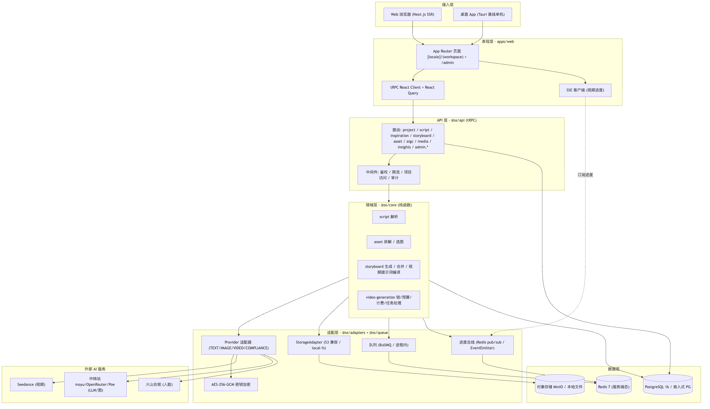
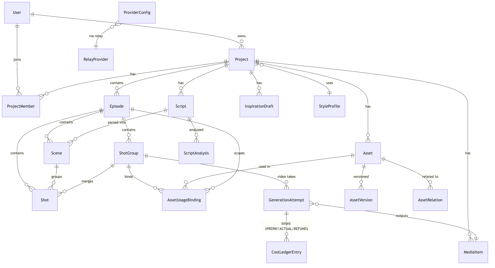
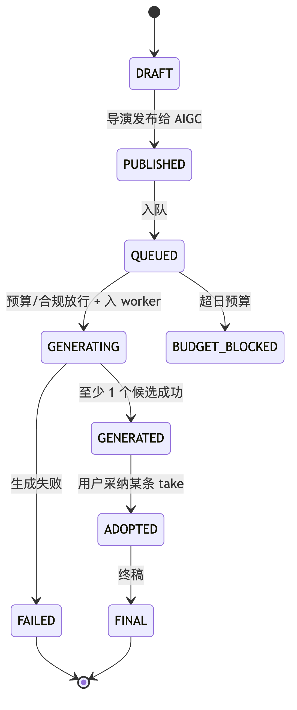
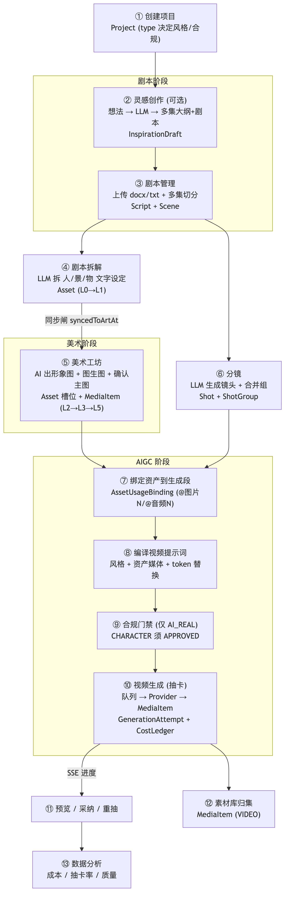
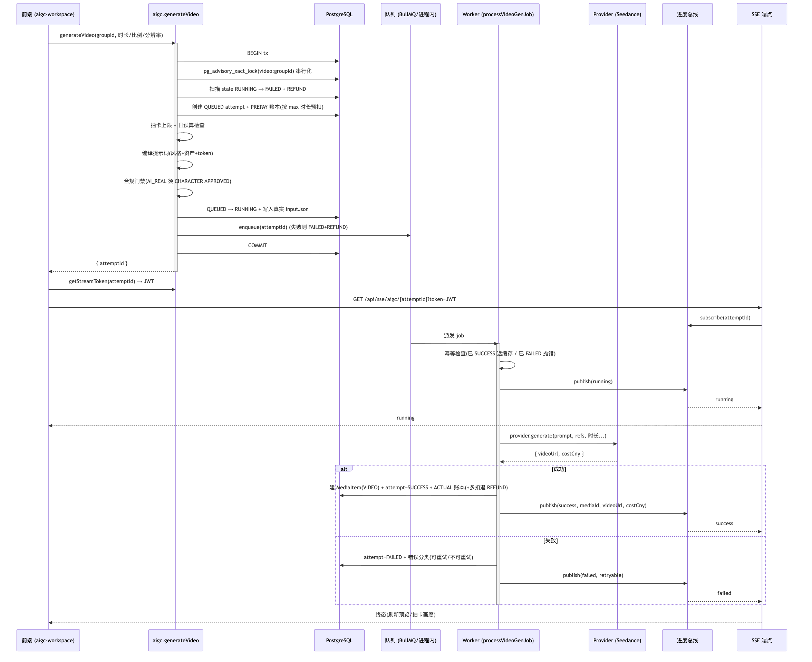
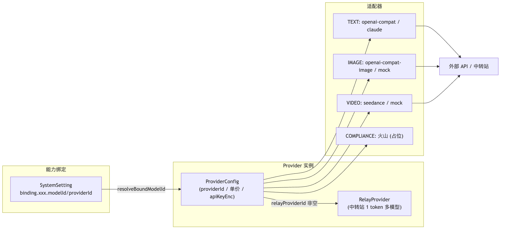
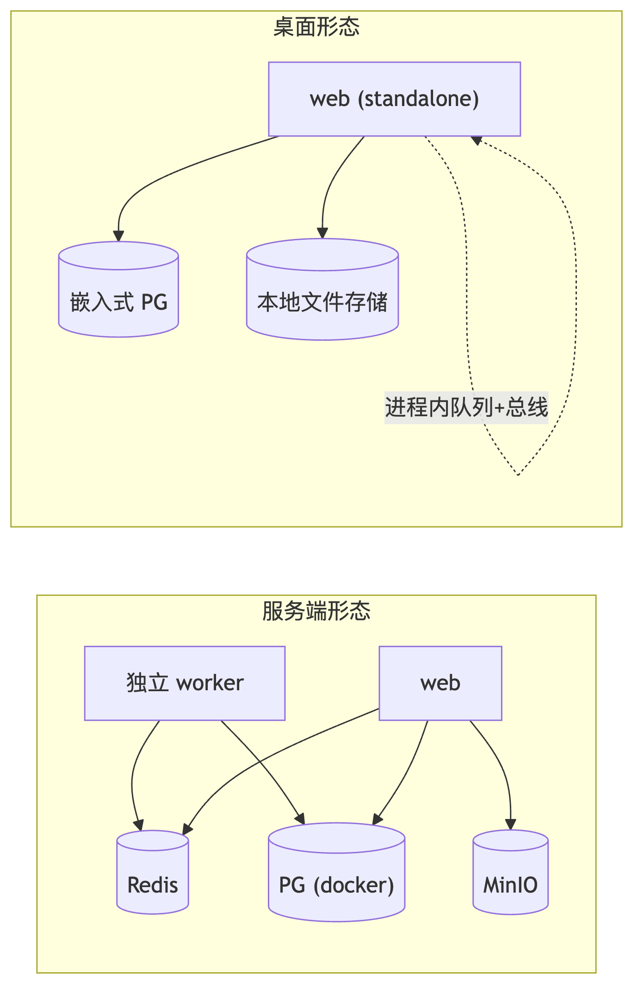

# StarsAlign Studio · 系统流程图册

> 本目录是 [`../DEVELOPMENT.md`](../DEVELOPMENT.md) 中 7 张流程图的**图片版**(PNG 高清位图 + SVG 矢量 + Mermaid 源码)。
> 每张图三种格式:`.mmd`(可编辑源)· `.png`(3x 位图,分享/插 PPT/Word)· `.svg`(矢量,任意缩放不糊)。

---

## 1. 系统分层架构

接入层 → 表现层 → API 层 → 领域层 → 适配层 → 数据层 → 外部 AI 服务,共七层及其调用关系。



> [SVG 矢量版](01-architecture.svg) · [Mermaid 源码](01-architecture.mmd)

---

## 2. 核心数据模型(ER 图)

Project → Episode → Scene → Shot / ShotGroup 主干 + Asset / MediaItem / GenerationAttempt / CostLedger / Provider 关系。



> [SVG 矢量版](02-er.svg) · [Mermaid 源码](02-er.mmd)

---

## 3. 镜头 / 资产状态机

DRAFT → PUBLISHED → QUEUED → GENERATING → GENERATED → ADOPTED → FINAL(含预算阻断 / 失败分支)。



> [SVG 矢量版](03-state-machine.svg) · [Mermaid 源码](03-state-machine.mmd)

---

## 4. 端到端业务流程

「从想法到成片」13 步主干:灵感 → 剧本 → 拆解 → 美术 → 分镜 → 绑定 → 编译 → 合规 → 视频生成 → 预览/采纳 → 素材库 → 分析(节点标注落库实体)。



> [SVG 矢量版](04-pipeline.svg) · [Mermaid 源码](04-pipeline.mmd)

---

## 5. 视频生成时序图

最复杂链路:事务 advisory 锁 → 预扣计费 → 提示词编译 → 合规门禁 → 入队 → Worker → Provider → SSE 进度 → 成功/失败 + 退款。



> [SVG 矢量版](05-video-sequence.svg) · [Mermaid 源码](05-video-sequence.mmd)

---

## 6. Provider 与绑定系统(三层抽象)

能力绑定(SystemSetting)→ Provider 实例(ProviderConfig / 中转站 RelayProvider)→ 适配器(TEXT/IMAGE/VIDEO/COMPLIANCE)。



> [SVG 矢量版](06-provider-binding.svg) · [Mermaid 源码](06-provider-binding.mmd)

---

## 7. 双形态部署对比

服务端形态(Redis + 独立 worker + MinIO + Docker PG)vs 桌面形态(嵌入式 PG + 本地文件 + 进程内队列/总线)。



> [SVG 矢量版](07-deploy.svg) · [Mermaid 源码](07-deploy.mmd)

---

## 重新生成

图源自 `../DEVELOPMENT.md` 的 Mermaid 代码块。修改文档后重渲:

```bash
# 1. 抽取 mermaid 源码到本目录(node 脚本见提交历史 / 或手动从 DEVELOPMENT.md 复制)
# 2. 渲染(mermaid-cli,复用本机 Chrome 免下载 Chromium):
for n in docs/diagrams/*.mmd; do
  base="${n%.mmd}"
  npx -y @mermaid-js/mermaid-cli -i "$n" -o "$base.png" -t default -b white -s 3 \
    -p <(echo '{"executablePath":"/Applications/Google Chrome.app/Contents/MacOS/Google Chrome","args":["--no-sandbox"]}')
  npx -y @mermaid-js/mermaid-cli -i "$n" -o "$base.svg" -t default -b white \
    -p <(echo '{"executablePath":"/Applications/Google Chrome.app/Contents/MacOS/Google Chrome","args":["--no-sandbox"]}')
done
```

> Windows 设备改 `executablePath` 为本机 Chrome/Edge 路径即可;或装 `pnpm add -g @mermaid-js/mermaid-cli` 用打包 Chromium。
